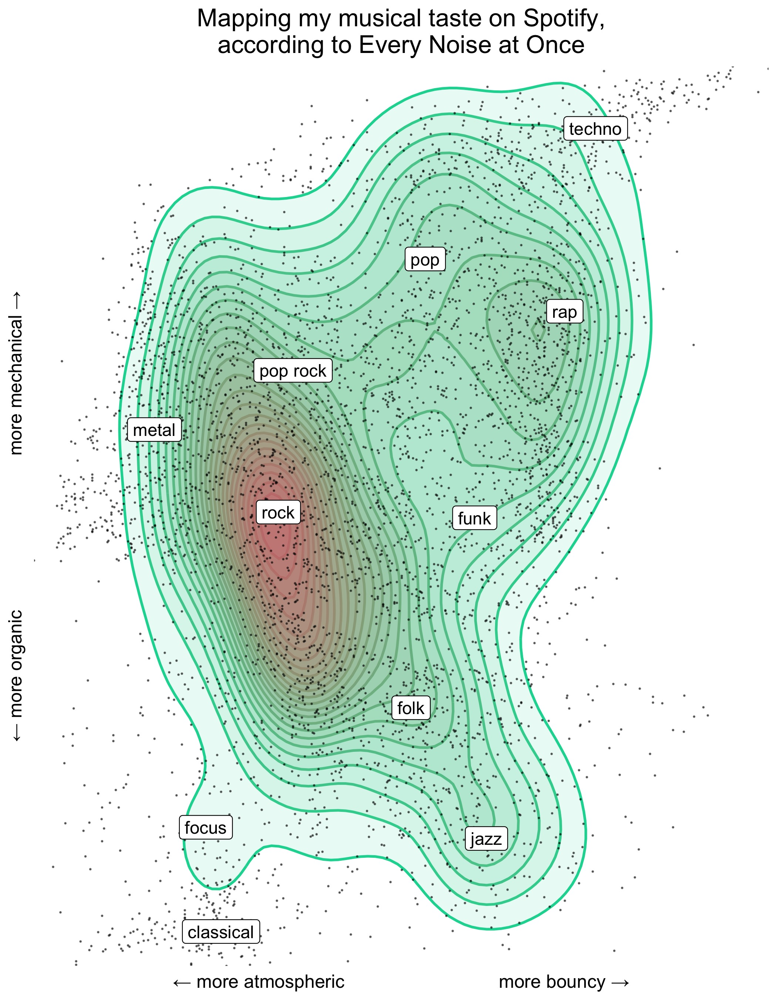

## spotify genre map using [Every Noise at Once](http://everynoise.com/)

A visualization using Spotify's artist/genre classification (using the Spotify API) and the Every Noise at Once project. Currently this project is just a collection of scripts to visualize my own Spotify library in two dimensional space but eventually I would like to expand this project to be interactive/public for all.

A tweeted initial results [here](https://twitter.com/ben_tanen/status/1287392772224241667).

Feel free to download/fork these scripts and try it on your own library.
